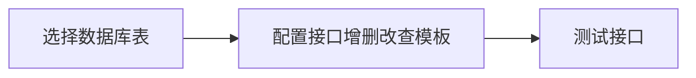

# 介绍 

## 产品定义 
低代码接口开发平台是一个一站式接口生成平台，通过可视化配置自动生成标准化的 RESTful 接口

## 产品特性 
- 降低开发成本：低代码开发模式，可显著提升开发效率、简化开发复杂度，有效抑制后端接口实现中的代码膨胀
- 统一接口规范：规范访问URI、请求参数、返回数据格式、保证系统间API一致性
- 模板化开发：支持APIJSON模板与Mybatis模板，通过编写json与sql模板简化API开发，聚焦核心数据操作逻辑
- 数据库适配：支持 Oracle、Sqlserver、Mysql、Postgresql、Sqlite，支持配置多源数据库

## 产品目标 
- 提升接口开发效率：后端人员只需编写Json与Sql模板即可生成数据接口
- 简化接口对接流程：前端人员可直接通过平台测试接口并验证输入输出数据

## 开发背景
&nbsp;&nbsp;&nbsp;&nbsp;在传统后端接口开发场景下，针对单个模块或功能往往需要编写大量接口来实现数据操作。即便借助代码自动生成和 ORM，依然要维护数量庞大的业务数据对象代码。引入 APIJSON 将部分后端工作转交给前端，却又带来了接口管理失控、鉴权管理困难等问题。为此，基于 APIJSON 与 MyBatis 构建了一个接口实现层，对接口地址、操作类型、操作模板（JSON、SQL）及返回数据格式进行统一管理，并加入访问控制。由此实现接口开发的低代码/无代码化、规范化与标准化，有效提升后端接口开发效率，简化前端对接流程，提高产品交付质量。

## 开发模式

## 适用场景
- 单表增删改查：单次操作只针对单表场景
- 多表关联查询：查询需要关联多张表，单次SQL执行即可完成操作

## 不适用场景
- 复杂接口操作：需要在接口内部操作多张表
- 调用外部接口：需要在接口内部调用外部接口
